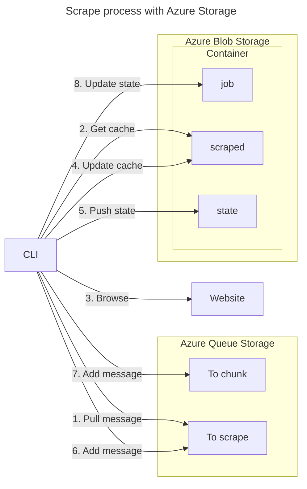
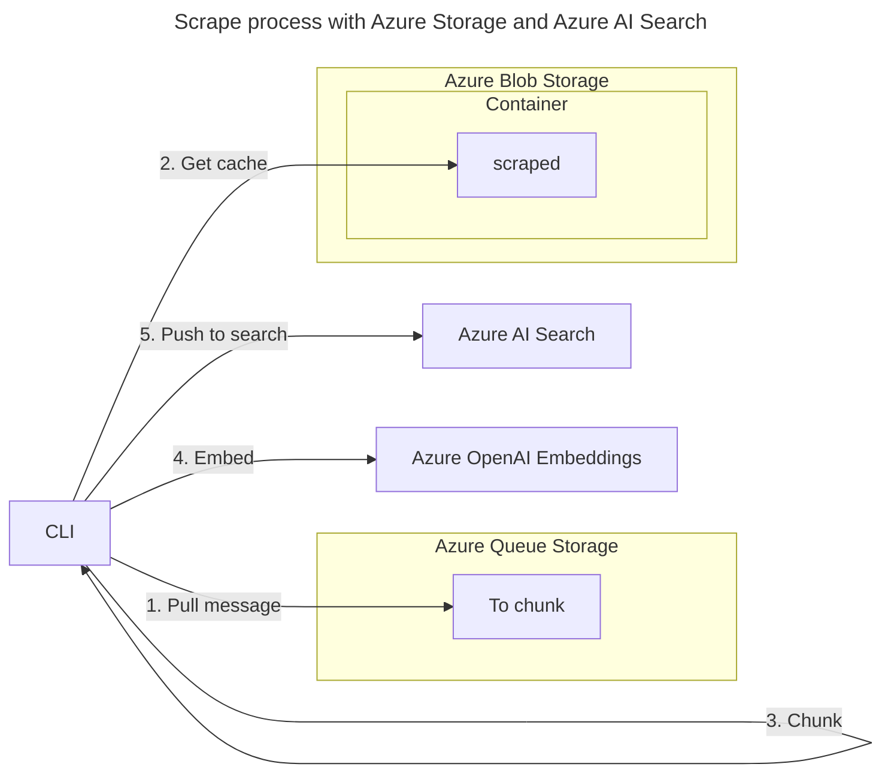

# 🛰️ Scrape It Now!

A website to scrape? There's a simple way.

<!-- github.com badges -->
[](https://github.com/clemlesne/scrape-it-now/releases)
[](https://github.com/clemlesne/scrape-it-now/blob/main/LICENSE)

## Features

Shared:

- [x] Decoupled architecture with [Azure Queue Storage](https://learn.microsoft.com/en-us/azure/storage/queues) or local [sqlite](https://sqlite.org)
- [x] Executable as a CLI with a [standalone binary](http://github.com/clemlesne/scrape-it-now/releases/latest)
- [x] Idenpotent operations that can be run in parallel
- [x] Scraped content is stored in [Azure Blob Storage](https://learn.microsoft.com/en-us/azure/storage/blobs) or local disk

Scraper:

- [x] Avoid re-scrape a page if it hasn't changed
- [x] Block ads to lower network costs with [The Block List Project](https://github.com/blocklistproject/Lists)
- [x] Explore pages in depth by detecting links and de-duplicating them
- [x] Extract markdown content from a page with [html2text](https://github.com/aaronsw/html2text)
- [x] Load dynamic JavaScript content with [Playwright](https://github.com/microsoft/playwright-python)
- [x] Preserve anonymity with a random user agent, random viewport size and no client hints headers
- [x] Show progress with a status command
- [x] Track progress of total network usage
- [ ] Enhance anonymity with proxies
- [ ] Respect [`robots.txt`](https://en.wikipedia.org/wiki/Robots.txt)

Indexer:

- [x] AI Search index is created automatically
- [x] Chunk markdown while keeping the content coherent
- [x] Embed chunks with OpenAI embeddings
- [x] Indexed content is semantically searchable with [Azure AI Search](https://learn.microsoft.com/en-us/azure/search)

## Installation

### From binary

[Download the latest release from the releases page](http://github.com/clemlesne/scrape-it-now/releases/latest). Binaries are available for Linux, macOS and Windows.

For configuring the CLI (including authentication to the backend services), use environment variables, a `.env` file or command line options.

### From sources

Application must be run with Python 3.12 or later. If this version is not installed, an easy way to install it is [pyenv](https://github.com/pyenv/pyenv).

```bash
# Download the source code
git clone https://github.com/clemlesne/scrape-it-now.git
# Move to the directory
cd scrape-it-now
# Run install scripts
make install dev
# Run the CLI
scrape-it-now --help
```

## How to use

### Scrape a website

#### Run a job

Usage with Azure Blob Storage and Azure Queue Storage:

```bash
# Azure Storage configuration
export AZURE_STORAGE_CONNECTION_STRING=xxx
# Run the job
scrape-it-now scrape run https://nytimes.com
```

Usage with Local Disk Blob and Local Disk Queue:

```bash
# Local disk configuration
export BLOB_PROVIDER=local_disk
export QUEUE_PROVIDER=local_disk
# Run the job
scrape-it-now scrape run https://nytimes.com
```

Example output:

```bash
❯ Starting scraping job 7yz91ma
Queued 71/71 links for referrer https://www.google.com/search (1)
3 workers started
Browser chromium launched
...
Queued 15/28 links for referrer https://www.nytimes.com/2024/08/15/business/economy/kamala-harris-inflation-price-gouging.html (2)
Scraped https://www.nytimes.com/2024/08/15/business/economy/kamala-harris-inflation-price-gouging.html (2)
```

Most frequent options are:

| `Options` | Description | `Environment variable` |
|-|-|-|
| `--azure-storage-connection-string`</br>`-ascs` | Azure Storage connection string | `AZURE_STORAGE_CONNECTION_STRING` |
| `--blob-provider`</br>`-bp` | Blob provider | `BLOB_PROVIDER` |
| `--job-name`</br>`-jn` | Job name | `JOB_NAME` |
| `--max-depth`</br>`-md` | Maximum depth | `MAX_DEPTH` |
| `--queue-provider`</br>`-qp` | Queue provider | `QUEUE_PROVIDER` |
| `--whitelist`</br>`-w` | Whitelist | `WHITELIST` |

For documentation on all available options, run:

```bash
scrape-it-now scrape run --help
```

#### Show job status

Usage with Azure Blob Storage:

```bash
# Azure Storage configuration
export AZURE_STORAGE_CONNECTION_STRING=xxx
# Show the job status
scrape-it-now scrape status [job_name]
```

Usage with Local Disk Blob:

```bash
# Local disk configuration
export BLOB_PROVIDER=local_disk
# Show the job status
scrape-it-now scrape status [job_name]
```

Example output:

```bash
❯ {"created_at":"2024-08-16T15:33:06.602922Z","last_updated":"2024-08-16T16:17:51.571136Z","network_used_mb":5.650620460510254,"processed":1263,"queued":3120}
```

Most frequent options are:

| `Options` | Description | `Environment variable` |
|-|-|-|
| `--azure-storage-connection-string`</br>`-ascs` | Azure Storage connection string | `AZURE_STORAGE_CONNECTION_STRING` |
| `--blob-provider`</br>`-bp` | Blob provider | `BLOB_PROVIDER` |

For documentation on all available options, run:

```bash
scrape-it-now scrape status --help
```

### Index a scraped website

#### Run a job

Usage with Azure Blob Storage, Azure Queue Storage and Azure AI Search:

```bash
# Azure OpenAI configuration
export AZURE_OPENAI_API_KEY=xxx
export AZURE_OPENAI_EMBEDDING_DEPLOYMENT_NAME=xxx
export AZURE_OPENAI_EMBEDDING_DIMENSIONS=xxx
export AZURE_OPENAI_EMBEDDING_MODEL_NAME=xxx
export AZURE_OPENAI_ENDPOINT=xxx
# Azure Search configuration
export AZURE_SEARCH_API_KEY=xxx
export AZURE_SEARCH_ENDPOINT=xxx
# Azure Storage configuration
export AZURE_STORAGE_CONNECTION_STRING=xxx
# Run the job
scrape-it-now index run [job_name]
```

Usage with Local Disk Blob, Local Disk Queue and Azure AI Search:

```bash
# Azure OpenAI configuration
export AZURE_OPENAI_API_KEY=xxx
export AZURE_OPENAI_EMBEDDING_DEPLOYMENT_NAME=xxx
export AZURE_OPENAI_EMBEDDING_DIMENSIONS=xxx
export AZURE_OPENAI_EMBEDDING_MODEL_NAME=xxx
export AZURE_OPENAI_ENDPOINT=xxx
# Azure Search configuration
export AZURE_SEARCH_API_KEY=xxx
export AZURE_SEARCH_ENDPOINT=xxx
# Local disk configuration
export BLOB_PROVIDER=local_disk
export QUEUE_PROVIDER=local_disk
# Run the job
scrape-it-now index run [job_name]
```

Example output:

```bash
❯ Starting indexing job 7yz91ma
5 workers started
...
434b227 chunked into 6 parts
434b227 is indexed
f001b3e chunked into 86 parts
f001b3e is already indexed
```

Most frequent options are:

| `Options` | Description | `Environment variable` |
|-|-|-|
| `--azure-openai-api-key`</br>`-aoak` | Azure OpenAI API key | `AZURE_OPENAI_API_KEY` |
| `--azure-openai-embedding-deployment-name`</br>`-aoedn` | Azure OpenAI embedding deployment name | `AZURE_OPENAI_EMBEDDING_DEPLOYMENT_NAME` |
| `--azure-openai-embedding-dimensions`</br>`-aoed` | Azure OpenAI embedding dimensions | `AZURE_OPENAI_EMBEDDING_DIMENSIONS` |
| `--azure-openai-embedding-model-name`</br>`-aoemn` | Azure OpenAI embedding model name | `AZURE_OPENAI_EMBEDDING_MODEL_NAME` |
| `--azure-openai-endpoint`</br>`-aoe` | Azure OpenAI endpoint | `AZURE_OPENAI_ENDPOINT` |
| `--azure-search-api-key`</br>`-asak` | Azure Search API key | `AZURE_SEARCH_API_KEY` |
| `--azure-search-endpoint`</br>`-ase` | Azure Search endpoint | `AZURE_SEARCH_ENDPOINT` |
| `--azure-storage-connection-string`</br>`-ascs` | Azure Storage connection string | `AZURE_STORAGE_CONNECTION_STRING` |
| `--blob-provider`</br>`-bp` | Blob provider | `BLOB_PROVIDER` |
| `--queue-provider`</br>`-qp` | Queue provider | `QUEUE_PROVIDER` |

For documentation on all available options, run:

```bash
scrape-it-now index run --help
```

## Architecture

### Scrape



### Index



## Advanced usage

### Source environment variables

To configure easily the CLI, source environment variables from a `.env` file. For example, for the `--azure-storage-connection-string` option:

```bash
AZURE_STORAGE_CONNECTION_STRING=xxx
```

For arguments that accept multiple values, use a space-separated list. For example, for the `--whitelist` option:

```bash
WHITELIST=learn\.microsoft\.com,^/(?!en-us).*,^/[^/]+/answers/,^/[^/]+/previous-versions/ go\.microsoft\.com,.*
```

### Application cache directory

The cache directoty depends on the operating system:

- `~/.config/scrape-it-now` (Unix)
- `~/Library/Application Support/scrape-it-now` (macOS)
- `C:\Users\<user>\AppData\Roaming\scrape-it-now` (Windows)

### Broswer binary installation

Browser binaries are automatically downloaded or updated at each run. Browser is Chromium and it is not configurable (feel free to open an issue if you need another browser), it weights around 450MB. Cache is stored in the cache directory.

### How Local Disk storage works

Local Disk storage is used for both blob and queue. It is not recommended for production use, as it is not scalable, not fault-tolerant and not parallelizable.

Local Disk Blob uses a directory structure to store blobs. Each blob is stored in a file with the blob name as the file name. Lease is implemented with lock files. By default, files are stored in a directory relative to the command execution directory.

Local Disk Queue uses a SQLite database to store messages. Database is stored in the cache directory. SQL databases implement visibility timeout and deletion tokens to ensure consistency to the stateless queue services like Azure Queue Storage.
