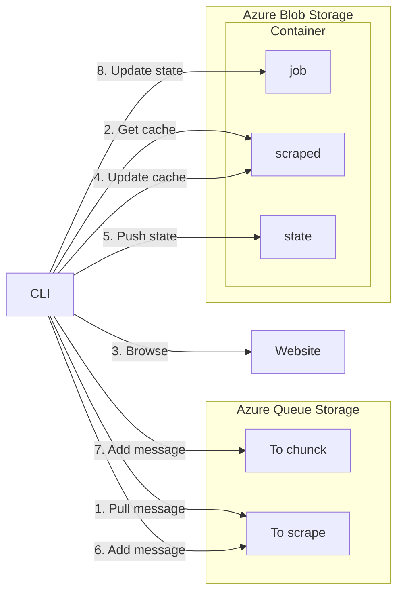
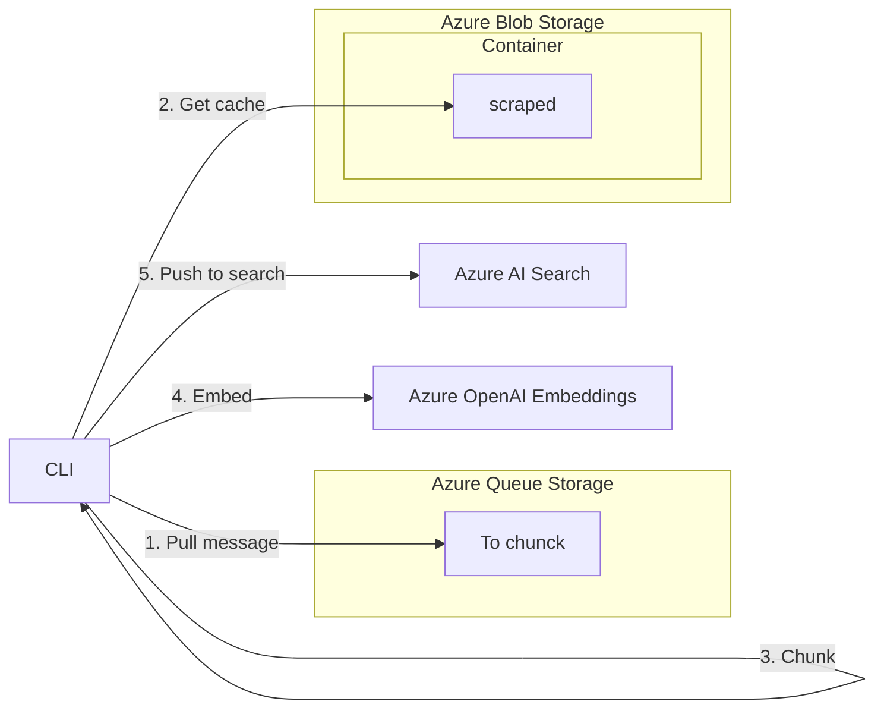

# 🛰️ Scrape It Now!

A website to scrape? There's a simple way.

## Features

Shared:

- [x] Decoupled architecture with [Azure Queue Storage](https://learn.microsoft.com/en-us/azure/storage/queues)
- [x] Idenpotent operations that can be run in parallel
- [x] Scraped content is stored in [Azure Blob Storage](https://learn.microsoft.com/en-us/azure/storage/blobs)

Scraper:

- [x] Avoid re-scrape a page if it hasn't changed
- [x] Block ads to lower network costs with [The Block List Project](https://github.com/blocklistproject/Lists)
- [x] Explore pages in depth by detecting links and de-duplicating them
- [x] Extract markdown content from a page with [html2text](https://github.com/aaronsw/html2text)
- [x] Load dynamic JavaScript content with [Playwright](https://github.com/microsoft/playwright-python)
- [x] Show progress with a status command
- [x] Track progress of total network usage
- [ ] Respect [`robots.txt`](https://en.wikipedia.org/wiki/Robots.txt)

Indexer:

- [x] Chunck markdown while keeping the content coherent
- [x] Embed chuncks with OpenAI embeddings
- [x] Indexed content is semantically searchable with [Azure AI Search](https://learn.microsoft.com/en-us/azure/search)

## How to use

### Scrape a website

#### Run a job

Basic usage:

```bash
export AZURE_STORAGE_CONNECTION_STRING=xxx
scrape-it-now scrape run https://nytimes.com
```

Most frequent options are:

| `Options` | Description | `Environment variable` |
|-|-|-|
| `--azure-storage-connection-string`</br>`-ascs` | Azure Storage connection string | `AZURE_STORAGE_CONNECTION_STRING` |
| `--job-name`</br>`-jn` | Job name | `JOB_NAME` |

For documentation on all available options, run:

```bash
scrape-it-now scrape run --help
```

#### Show job status

Basic usage:

```bash
export AZURE_STORAGE_CONNECTION_STRING=xxx
scrape-it-now scrape status [job_name]
```

Most frequent options are:

| `Options` | Description | `Environment variable` |
|-|-|-|
| `--azure-storage-connection-string`</br>`-ascs` | Azure Storage connection string | `AZURE_STORAGE_CONNECTION_STRING` |

For documentation on all available options, run:

```bash
scrape-it-now scrape status --help
```

### Index a scraped website

#### Run a job

Basic usage:

```bash
export AZURE_OPENAI_API_KEY=xxx
export AZURE_OPENAI_EMBEDDING_DEPLOYMENT_NAME=xxx
export AZURE_OPENAI_EMBEDDING_DIMENSIONS=xxx
export AZURE_OPENAI_ENDPOINT=xxx
export AZURE_SEARCH_API_KEY=xxx
export AZURE_SEARCH_ENDPOINT=xxx
export AZURE_SEARCH_INDEX_NAME=xxx
export AZURE_STORAGE_CONNECTION_STRING=xxx
scrape-it-now index run [job_name]
```

Most frequent options are:

| `Options` | Description | `Environment variable` |
|-|-|-|
| `--azure-openai-api-key`</br>`-aoak` | Azure OpenAI API key | `AZURE_OPENAI_API_KEY` |
| `--azure-openai-embedding-deployment-name`</br>`-aoedn` | Azure OpenAI embedding deployment name | `AZURE_OPENAI_EMBEDDING_DEPLOYMENT_NAME` |
| `--azure-openai-embedding-dimensions`</br>`-aoed` | Azure OpenAI embedding dimensions | `AZURE_OPENAI_EMBEDDING_DIMENSIONS` |
| `--azure-openai-endpoint`</br>`-aoe` | Azure OpenAI endpoint | `AZURE_OPENAI_ENDPOINT` |
| `--azure-search-api-key`</br>`-asak` | Azure Search API key | `AZURE_SEARCH_API_KEY` |
| `--azure-search-endpoint`</br>`-ase` | Azure Search endpoint | `AZURE_SEARCH_ENDPOINT` |
| `--azure-search-index-name`</br>`-asin` | Azure Search index name | `AZURE_SEARCH_INDEX_NAME` |
| `--azure-storage-connection-string`</br>`-ascs` | Azure Storage connection string | `AZURE_STORAGE_CONNECTION_STRING` |

For documentation on all available options, run:

```bash
scrape-it-now index run --help
```

## Architecture

### Scrape



### Index



## Advanced usage

### Source environment variables

To configure easily the CLI, source environment variables from a `.env` file. For example, for the `--azure-storage-connection-string` option:

```bash
AZURE_STORAGE_CONNECTION_STRING=xxx
```

For arguments that accept multiple values, use a space-separated list. For example, for the `--whitelist` option:

```bash
WHITELIST=learn\.microsoft\.com,^/(?!en-us).*,^/[^/]+/answers/,^/[^/]+/previous-versions/ go\.microsoft\.com,.*
```
